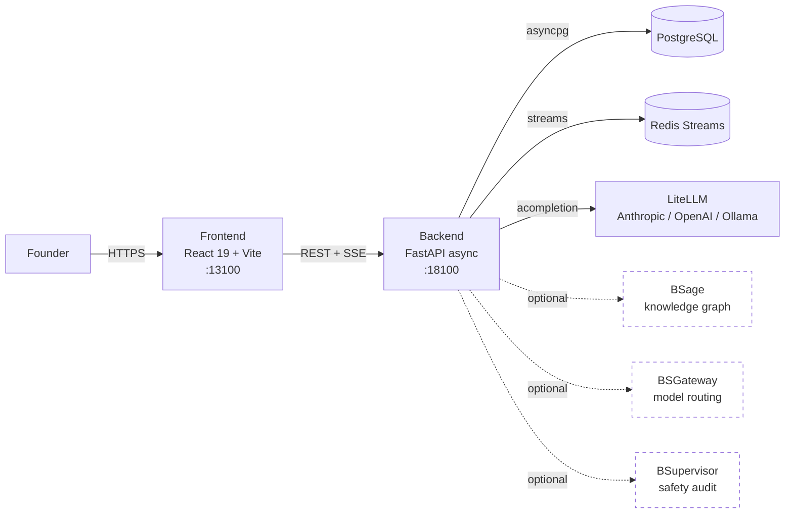
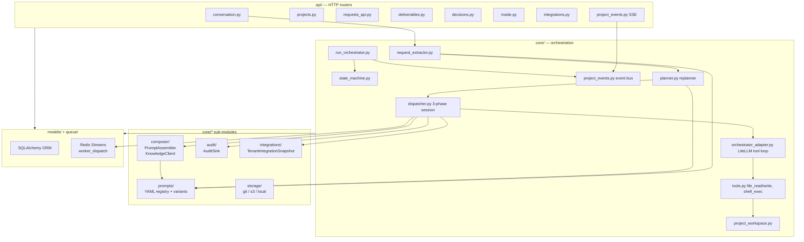
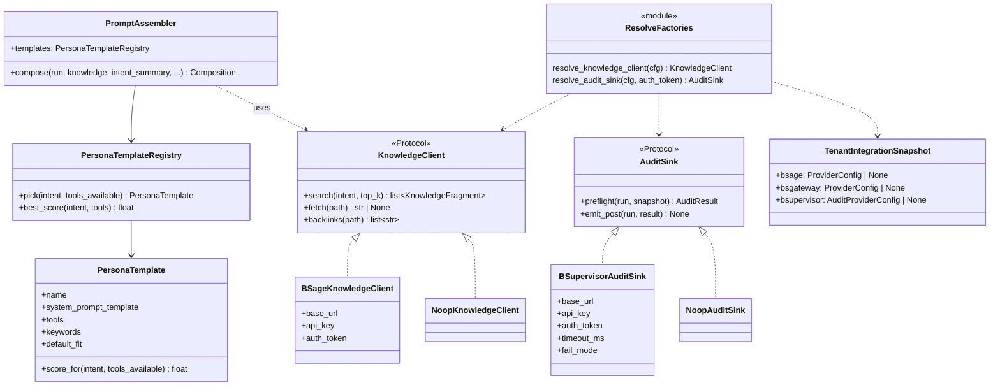
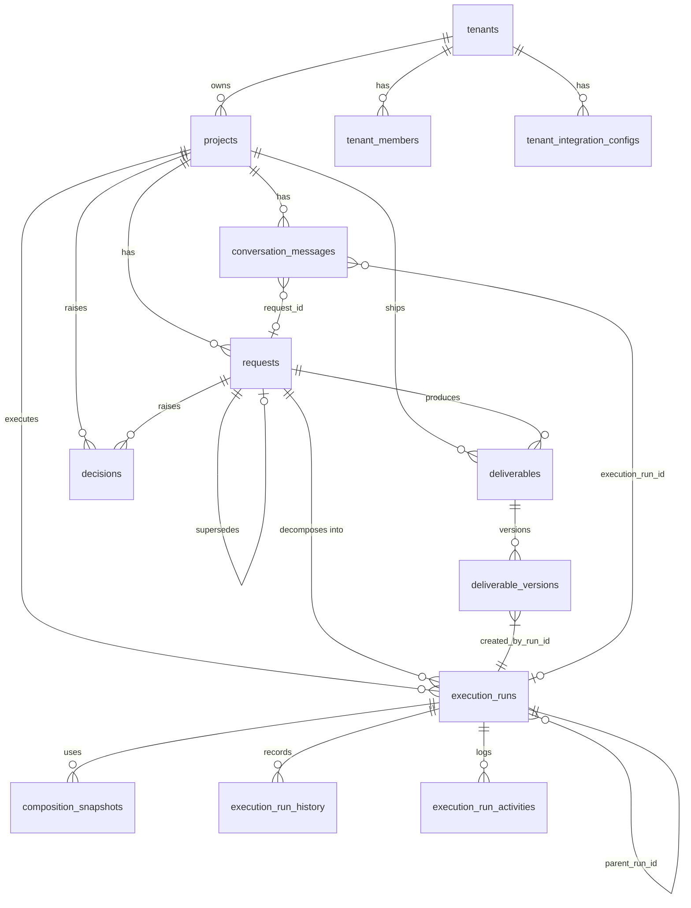
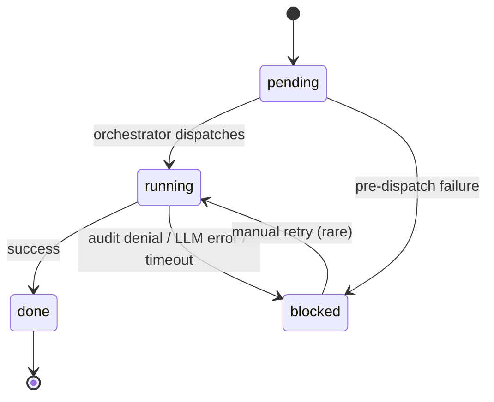
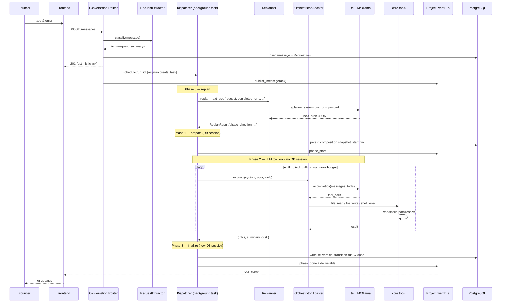
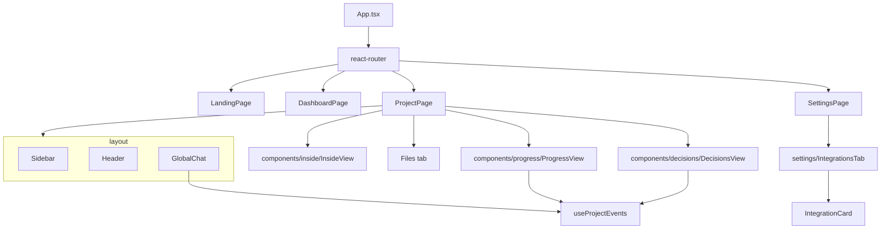
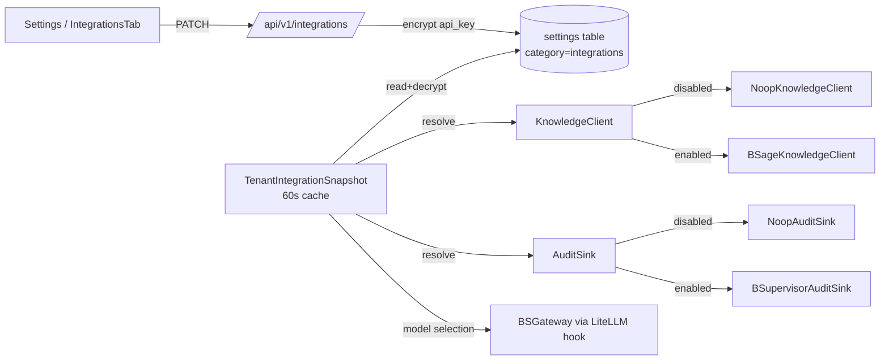
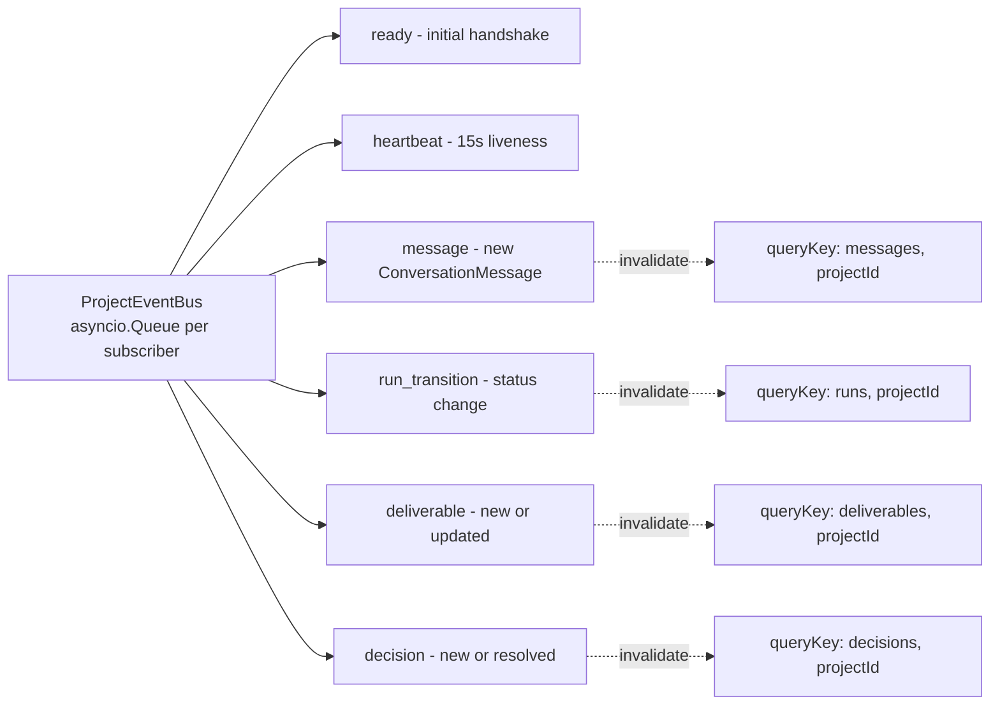

# BSNexus Architecture

Diagrams render natively on GitHub via Mermaid. Click any code block
header that says "Mermaid" to expand. The diagrams reflect the
post-founder-metaphor codebase (no agent/task/phase tables).

## 1. System context

How BSNexus relates to the rest of the BSVibe ecosystem and the
external runtime. All three sibling services are **optional** — when
disabled or unreachable, BSNexus falls back to a Noop provider and
continues working in degraded mode.



## 2. Backend module map

The backend is a single async monolith. The diagram groups modules
by responsibility; arrows show "calls into".



## 3. Class diagram — composition + audit + integration

These three Protocols are the degradable boundary: every external
service has a real client and a Noop fallback that satisfies the
same Protocol. The factory `resolve_*(cfg)` returns the right one
based on per-tenant config.



## 4. Class diagram — orchestrator core

The execution core: replanner picks the next step, dispatcher
manages session lifecycle, adapter runs the LLM tool loop, tool
calls touch the workspace.

```mermaid
classDiagram
    class ReplanResult {
        +decision: next_step | done | ask_founder
        +founder_message
        +phase_name?
        +phase_direction?
        +question?
        +options?
        +blocking
    }
    class Replanner {
        <<module: planner.py>>
        replan_next_step(request, completed_runs, ...) ReplanResult
    }

    class Dispatcher {
        <<module: dispatcher.py>>
        dispatch_run(run_id, ...) Task
        _dispatch_background(...) async
    }

    class RunOrchestrator {
        +on_run_completed(run, result, audit, ...)
        +schedule_next(run)
    }

    class LiteLLMOrchestratorAdapter {
        +model
        +project_id
        +api_key
        +base_url
        +execute(system_prompt, user_prompt, tools_allowed, history) dict
        -_complete(messages, tools) Any
    }

    class ToolRunLog {
        +project_id
        +invocations
        +errors
        +written: list~FileWrite~
        +shell: list~ShellExec~
    }

    class RunStateMachine {
        +transition(run, to_status, actor, reason)
    }

    Replanner ..> ReplanResult : returns
    Dispatcher ..> Replanner : Phase 0
    Dispatcher ..> LiteLLMOrchestratorAdapter : Phase 2
    Dispatcher ..> RunOrchestrator : Phase 3
    RunOrchestrator ..> RunStateMachine
    LiteLLMOrchestratorAdapter ..> ToolRunLog
    LiteLLMOrchestratorAdapter ..> "core.tools" : execute_tool_call
```

## 5. ER diagram — main schema

Founder-metaphor schema. Retired tables (agents, tasks, phases,
goals, plan_proposals) deleted. New tables in **bold** prefix.



## 6. Run state machine



`RunStateMachine.transition()` is the single write path — every
status change writes both an `execution_run_history` row and a
milestone `execution_run_activities` row, and publishes a
`run_transition` event to the per-project SSE stream.

## 7. Sequence diagram — Direction message → Deliverable

End-to-end flow when the founder sends a chat message in the
Direction surface. Highlights the 3-phase session model in the
dispatcher (prepare → LLM → finalize) so the DB pool is released
during the long-running LLM call.



## 8. Frontend component tree



## 9. Per-tenant integration config



## 10. SSE event types

The `GET /api/v1/projects/{id}/events` endpoint emits typed events.
The frontend `useProjectEvents` hook routes each into the right
react-query cache invalidation.



## See also

- [CLAUDE.md](../CLAUDE.md) — assistant rules + must/never list
- [docs/known-issues/](./known-issues/) — open watches
- [docs/product-direction/](./product-direction/) — strategic notes
